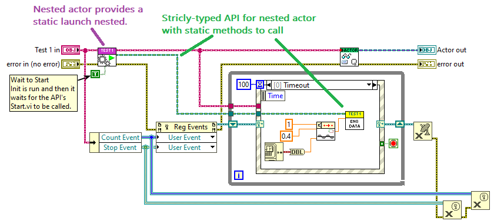
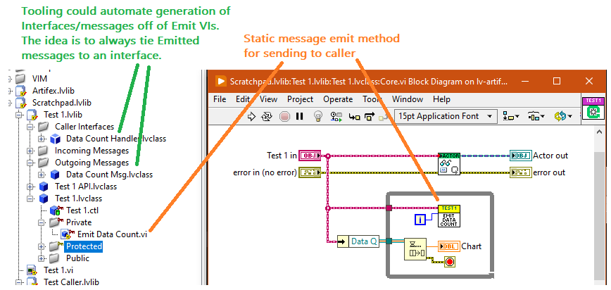
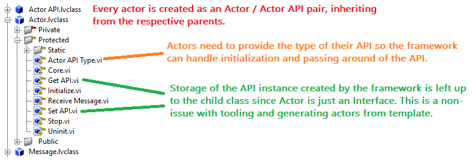
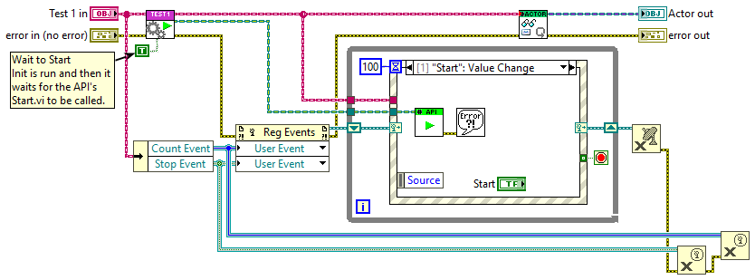
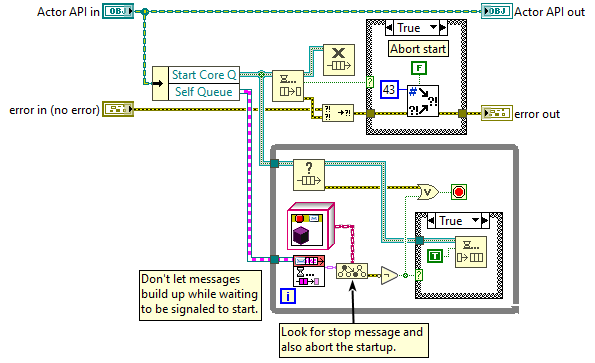

# lv-artifex
Alternative actor model for LabVIEW

This readme will call out all the static & strictly-typed designs that went into this experiment but all the abstract messaging / "standard" mechanisms exist similarly to AF as well. e.g. Actors provide a static / strictly-typed launch nested VI but the generic Launch Nested still exists at the abstract Actor parent level as well for times when actors are handled abstractly.

## Design Goals

This design (perhaps some of it makes its way back into AF proper?) aims for the following goals:

### Strictly-typed APIs when the actor type is known. (A message enqueuer doesn't say what messages are accepted)

This is ticket #1. I want to be able to (and someone using a component I've written) to be able to work in the block diagram more and rely less on 3rd party tooling and project navigation. Especially as actors and app hierarchies grow messaging capabilities get spread across interfaces and ancestor layers which can complicate finding messages. I also work in an environment that has bastardized usage of AF so I could be 100% wrong about how much of an issue this is.

### Formalize sending of messages up the tree

Provides a consistent and statically accessible pattern for how messages are sent up to callers. Actors emit messages by calling VIs directly accessible within themselves or exposed by ancestors. By formalizing the usage of interfaces, better tooling can be developed to trivialize using this pattern to ensure actors remain self-contained with regards to messaging caller actors. One key difference I've implemented in my version is that unknown message types is not an error by default. This more easily allows callers to decide which messages they get acted on by depending on which interfaces they've implemented.

### Actor (and message base) as an Interface

This is mainly experimentation. I've come across some situations where it would have been nice to inject actor behavior at child layer of a hierarchy which isn't possible with AF Actors as an abstract class. Children layers could provide Actor messaging and interfacing to a component as an implementation/run-time choice.

This is also a side effect of me pushing towards having strongly-typed APIs for actors. It would be unwieldy to have methods in the actor class that both perform the action and send the action request so I moved all the requests into the external API. This follows the existing AF pattern with the added external class that hides the usage of messages. I also prefer avoiding exposing mechanisms to external code granted AF doesn't work well with non-AF so this is likely moot. With the external API used to organize the means of interacting with an actor and needing the messaging queues it was possible to then have Actor be an interface as long as children were made to be responsible for storing the API instance. Without tooling there's definitely a small amount of boiler-plate resulting from this but tooling and generation of Actors from templates would obviate the small extra effort this otherwise requires.

Eventually I'd like to experiment with means of integrating actors into non-actor apps more easily and this feels like it's starting in that direction.

### More flexible Actor startup/initialization

In applications at work we often have a manager actor responsible for dynamically launching several nested processes and if there is any initialization error then it is supposed to shutdown itself and any nested actors that did successfully launch. The above screenshot shows a single nested actor being launched with the commanded start option enabled but could easily scale to launching several actors and don't bother letting them get into their actor cores and trying to launch additional nested actors if its all going to be torn down anyways. All of the Starts could be masked by an error case structure from the launches.

This does create a situation where an initialized nested actor could begin receiving messages well before its messaging loop would start which could lead to memory/performance issues if state is managed improperly by the caller. I personally see this as a non-issue since the caller explicitly decides to use this capability and should be written accordingly. To prevent potential memory issues and CPU hogging of handling a backlog of messages that queued up while it was waiting to be started, I've defaulted to dropping messages received during this period.
